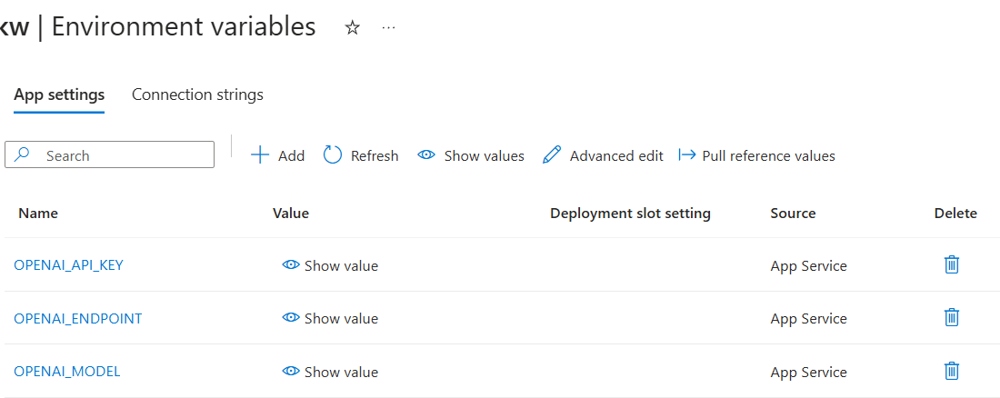

# Streamlit Samples on Azure App Services

This is couple of streamlit on Azure App Services samples.
1. A simple streamlit application
2. An OpenAI chat application built on steamlit which uses an Azure OpenAI service.

This has been forked from https://github.com/benalexkeen/streamlit-azure-app-services

# Deployment

The deployment below, creates the Azure OpenAI chat example using an App Services startup command to ensure the App Service runtime plays well with Streamlit.

```
python -m streamlit run app/openai-chat.py --server.port 8000 --server.address 0.0.0.0"
```

[](https://portal.azure.com/#create/Microsoft.Template/uri/https%3A%2F%2Fraw.githubusercontent.com%2Fjometzg%2Fstreamlit-azure-app-services%2Fmain%2Fazuredeploy.json)

There are some manual settings that need to be done in the *Environment variables* section of the web app. These are to connect the app to the correct Azure OpenAI service instance.


